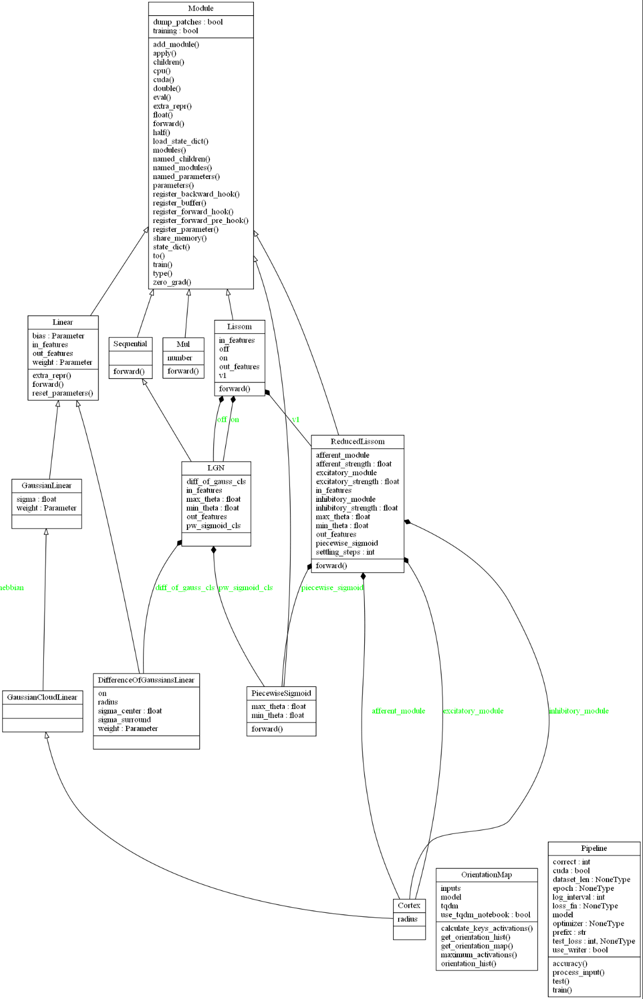
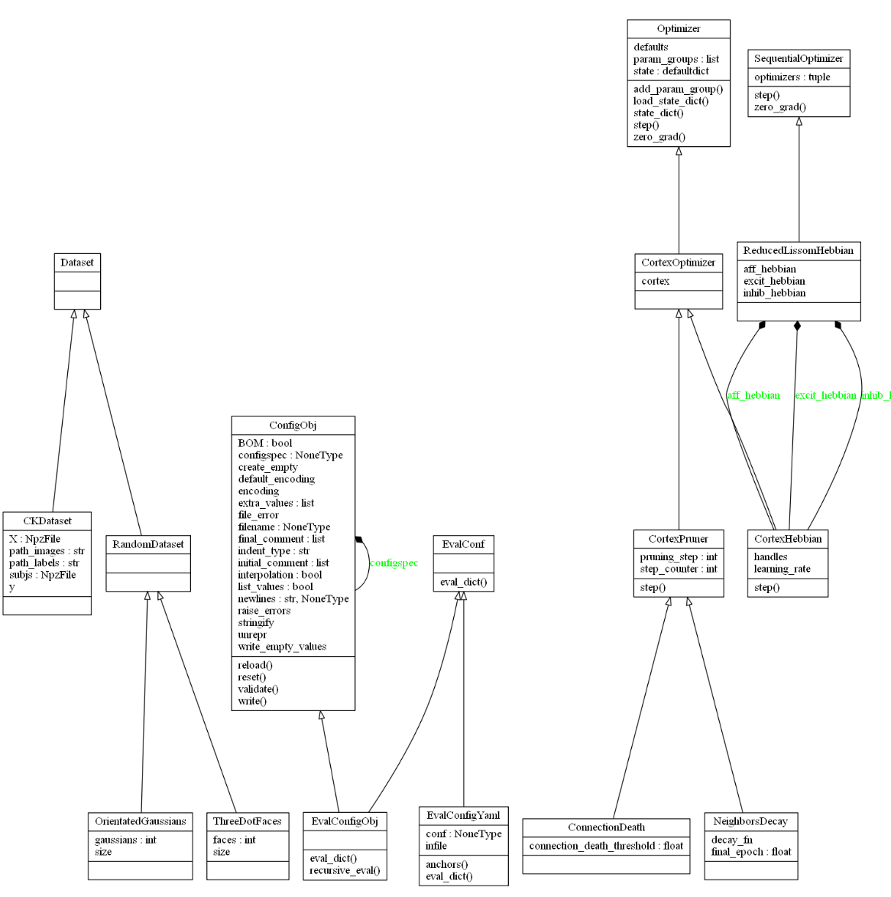

.. pylissom documentation master file, created by
   sphinx-quickstart on Tue Jun  5 22:22:59 2018.
   You can adapt this file completely to your liking, but it should at least
   contain the root `toctree` directive.

Pylissom documentation
======================

Pylissom is a Pytorch extension implementing the LISSOM network and other tools, based in the Topographica framework.

It's split in two parts, the core nn and optim packages, which implement the network itself,
 and the datasets, models and utils packages, that consist of a researcher's toolkit akin to Topographica features.

[LISSOM](http://homepages.inf.ed.ac.uk/jbednar/rflissom_small.html) is a model of human neocortex (mainly modeled on visual cortex) at a neural column level. The model was developed by Bednar, Choe, Miikkulainen, and Sirosh, at the University of Texas

[Topographica](http://ioam.github.io/topographica/index.html) is an old software package for computational modeling of neural maps, developed by the the same team of LISSOM. The goal is to help researchers understand brain function at the level of the topographic maps that make up sensory and motor systems, but became outdated over the years.

.. toctree::
   :caption: Package Reference
   :maxdepth: 1

   _modules/pylissom
   _modules/pylissom.datasets
   _modules/pylissom.models
   _modules/pylissom.nn.functional
   _modules/pylissom.nn.modules
   _modules/pylissom.optim
   _modules/pylissom.utils
   _modules/pylissom.utils.config
   _modules/pylissom.utils.plotting
   _modules/pylissom.utils.training

Getting Started
---------------

There is an UML class diagram for reference at the end of this page. And for hands-on examples there are jupyter notebooks at the [github's page](https://github.com/hernanbari/pylissom). If Github is not rendering them, we leave these links at your disposal:

[Linear modules](https://nbviewer.jupyter.org/github/hernanbari/pylissom/blob/master/notebooks/Tests_simple_modules.ipynb)

[Lissom modules](https://nbviewer.jupyter.org/github/hernanbari/pylissom/blob/master/notebooks/Tests_lissom_modules.ipynb)

[Optimizers](https://nbviewer.jupyter.org/github/hernanbari/pylissom/blob/master/notebooks/Test_optimizers.ipynb)

[Orientation Maps](https://nbviewer.jupyter.org/github/hernanbari/pylissom/blob/master/notebooks/Orientation_preferences.ipynb)

Installation
------------

You should first install pytorch with conda as explained at: https://pytorch.org/

Install pylissom by running:

    pip install --index-url https://test.pypi.org/simple/ --extra-index-url https://pypi.org/simple pylissom

The code is hosted in pypi: https://test.pypi.org/project/pylissom/

Contribute
----------

- Source Code: https://github.com/hernanbari/pylissom

License
-------

The project is licensed under the GPLv3 license.

Indices and tables
==================

* :ref:`genindex`
* :ref:`modindex`

UML diagrams for refernce
=========================

   Modules (neural layers) classes

   Optimizer, dataset and configuration classes

.. .. uml:: pylissom
    :classes:
    :packages:
