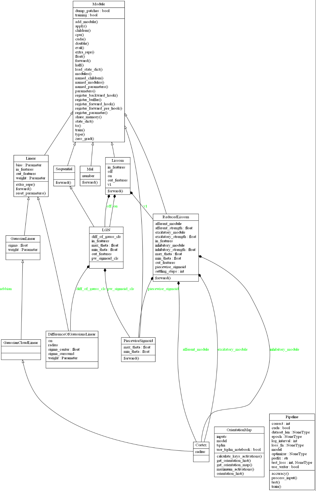

UML diagrams
============
I present an auto-generated UML class diagram of the main classes in **pylissom**,
starting with the modules and supervised learning classes. The arrows with hollow triangle tips
represent inheritance, and the black filled diamond tips represent the
composition relationships, with the parameters name in the containing
class in green.

**WARNING**: the plot was drawn statically so it may be out of date with the source code.

   Modules (neural layers) classes

At the top, we see that all classes inherit from *Module*, the pytorch
abstract class for network layers. Reading from the left side of the
plot we see the *Linear* module, also a pytorch class, which only
applies a linear transformation to the incoming data:
:math:`y = Ax + b`.

I implemented the LISSOM connection fields inheriting from such *Linear* module, in the
DifferenceOfGaussiansLinear, GaussianLinear, GaussianCloadLinear and
Cortex classes.

A Composition design pattern was used for the higher and lower level
layers. Complex classes receive as parameters for initialization simpler
layers and thus are associated with them in the UML diagram. The higher
level classes inherit from the *Module* base class, such as Lissom, LGN,
and ReducedLissom, and are associated to the linear modules and the
PiecewiseSigmoid class that implements the LISSOM activation.

For example, the ReducedLissom is the name given in by the LISSOM creators to the brain V1, which has
afferent, excitatory and inhibitory modules, being Cortex classes. And
the Lissom class is the V1 plus two LGN maps representing the on and off
channels of the brain Visual Cortex. In the figure are also the OrientationMap class, and the Pipeline class.

In the next Fig. are the dataset, configuration and optimizers classes:

.. figure::  uml_images/classes_pylissom2.png
   :align:   center

   Optimizer, dataset and configuration classes

Reading from the left, we see the pytorch *Dataset* abstract class,
representing the input data of the neural network models. *Dataset* is a
python *iterable*, the reason why it doesn't have any attributes or
functions. I provide the OrientedGaussians and ThreeDotFaces as datasets
and other utils that I used that a Lissom researcher will find useful as
a starting point, representing common stimuli for a Lissom network.

Next to the right, we see the classes that solve the configuration
problem of LISSOM. The
EvalConfigObj and EvalConfigYaml are the two classes I provide to the
end user, extending the yaml and ConfigObj libraries, and are used by
default in the canned models package I also provide.

And finally, the optimizer classes implement Lissom learning. The
pytorch *Optimizer* abstract base class is the interface to neural layer
learning. The CortexHebbian class is the most important, it implements
the Lissom learning with the Hebbian rule for a set of neural
connections such as the afferent, excitatory or inhibitory.

In consequence, with three CortexHebbian we can have a ReducedLissom
(V1) optimizer, which I called ReducedLissomHebbian. The ConnectionDeath
and NeighborsDecay are other optimizers I provide that are common to LISSOM.

.. .. uml:: pylissom
    :classes:
    :packages:
