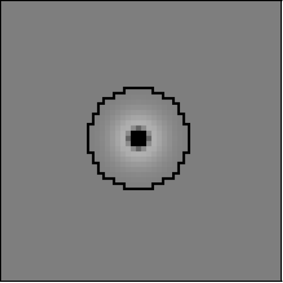

.. role:: raw-latex(raw)
   :format: latex
..

.. _ch:lissom:

Lissom
======

*The LISSOM model focuses on V1 and the structures to which it connects.
This note explains the key concepts of the LISSOM networks: its
architecture, activation and learning rule.*

LISSOM principles
-----------------

LISSOM is a laterally connected map model of the Primary Visual Cortex
:raw-latex:`\cite{Miik91}`:raw-latex:`\cite{Sirosh}`:raw-latex:`\cite{Miikk97}`.
The model is based on self-organizing maps, but its connectivity,
activation, and learning mechanisms are designed to capture the
essential biological processes in more detail.

LISSOM is based on five principles:

#. The central layout of the LISSOM model is a two-dimensional array of
   computational units, corresponding to vertical columns in the cortex.
   Such columns act as functional units in the cortex, responding to
   similar inputs, and therefore form an appropriate level of
   granularity for a functional model.

#. Each unit receives input from a local anatomical receptive field in
   the retina, mediated by the ON-center and OFF-center channels of the
   LGN. Such connectivity corresponds to the neural anatomy; it also
   allows modeling a large area of the visual cortex and processing
   large realistic visual inputs, which in turn allows studying higher
   visual function such as visual illusions, grouping, and face
   detection.

#. The cortical units are connected with excitatory and inhibitory
   lateral connections that adapt as an integral part of the
   self-organizing process.

#. The units respond by computing a weighted sum of their input, limited
   by a logistic (sigmoid) nonlinearity. This is a standard model of
   computation in the neuronal units that matches their biological
   characteristics well.

#. The learning is based on Hebbian adaptation with divisive
   normalization. Hebbian learning is well supported by neurobiological
   data and biological experiments have also suggested how normalization
   could occur in animals.

In other words, LISSOM takes the central idea of self-organizing maps
(1), and implements it at a level of known visual cortex structures (2
and 3) and processes (4 and 5). Although each of these principles has
been tested in other models, their combination is novel and allows
LISSOM to account for a wide range of phenomena in the development,
plasticity, and function of the primary visual cortex.

.. _sec:lissom_arch:

The LISSOM model
----------------

   
   **Basic LISSOM model of the primary visual cortex.** The core of the
   LISSOM model consists of a two-dimensional array of computational
   units representing columns in V1. These units receive input from the
   retinal receptors through the ON/OFF channels of the LGN, and from
   other columns in V1 through lateral connections. The solid circles
   and lines delineate the receptive fields of two sample units in the
   LGN and one in V1, and the dashed circle in V1 outlines the lateral
   connections of the V1 unit. The LGN and V1 activation in response to
   a sample input on the retina is displayed in gray-scale coding from
   white to black (low to high).

The V1 network in LISSOM is a sheet of N x N interconnected
computational units, or “neurons”. Because the focus is on the
two-dimensional organization of the cortex, each neuron in V1
corresponds to a vertical column of cells through the six layers of the
biological cortex. This columnar organization helps make the problem of
simulating such a large number of neurons tractable, and is viable
because the cells in a column generally fire in response to the same
inputs. The activity of each neuron is represented by a continuous
number within [0..1]. Therefore, it is important to keep in mind that
LISSOM neurons are not strictly identifiable with single cells in the
biological cortex; instead, LISSOM models biological mechanisms at an
aggregate level.

Each cortical neuron receives external input from two types of neurons
in the LGN: ON-center and OFF-center. The LGN neurons in turn receive
input from a small area of the retina, represented as an R x R array of
photoreceptor cells. The afferent input connections from the retina to
LGN and LGN to V1 are all excitatory. In addition to the afferent
connections, each cortical neuron has reciprocal excitatory and
inhibitory lateral connections with other neurons. Lateral excitatory
connections have a short range, connecting only close neighbors in the
map. Lateral inhibitory connections run for long distances, but may be
patchy, connecting only selected neurons.

The ON and OFF neurons in the LGN represent the entire pathway from
photoreceptor output to the V1 input, including the ON/OFF processing in
the retinal ganglion cells and the LGN. Although the ON and OFF neurons
are not always physically separated in the biological pathways, for
conceptual clarity they are divided into separate channels in LISSOM.
Each of these channels is further organized into an L x L array
corresponding to the retinotopic organization of the LGN. For simplicity
and computational efficiency, only single ON and OFF channels are used
in LISSOM, but multiple channels could be included to represent
different spatial frequencies. Also, the photoreceptors are uniformly
distributed over the retina; since the inputs are relatively small in
the most common LISSOM experiments, the fovea/periphery distinction is
not crucial for the basic model.

Each neuron develops an initial response as a weighted sum (scalar
product) of the activation in its afferent input connections. The
lateral interactions between cortical neurons then focus the initial
activation pattern into a localized response on the map. After the
pattern has stabilized, the connection weights of cortical neurons are
modified. As the self-organization progresses, these neurons grow more
nonlinear and weak connections die off. The result is a self-organized
structure in a dynamic equilibrium with the input.

The following subsections describe the specific components of the LISSOM
model in more detail. They focus on the basic version of the model
trained with unoriented Gaussian inputs, to highlight the basic
principles as clearly as possible.

Connections to the LGN
~~~~~~~~~~~~~~~~~~~~~~

LISSOM focuses on learning at the cortical level, so all connections to
neurons in the ON and OFF channels are set to fixed strengths.

The strengths were chosen to approximate the receptive fields that have
been measured in adult LGN cells, using a standard
difference-of-Gaussians model. First, the center of each LGN receptive
field is mapped to the location in the retina corresponding to the
location of the LGN unit. This mapping ensures that the LGN will have
the same two-dimensional topographic organization as the retina. Using
that location as the center, the weights are then calculated from the
difference of two normalized Gaussians. More precisely, the weight
:math:`L_{xy,ab}` from receptor (x, y) in the receptive field of an
ON-center cell (a, b) with center :math:`(x_c,y_c)` is given by the
following equation, where :math:`\sigma_c` determines the width of the
central Gaussian and :math:`\sigma_s` the width of the surround
Gaussian:

.. math:: L_{xy,ab}=\frac{\exp(-\frac{(x-x_c)^2+(y-y_c)^2}{\sigma_c^2})}{\sum_{uv}\exp(-\frac{(u-x_c)^2+(v-y_c)^2}{\sigma_c^2})} - \frac{\exp(-\frac{(x-x_c)^2+(y-y_c)^2}{\sigma_s^2})}{\sum_{uv}\exp(-\frac{(u-x_c)^2+(v-y_c)^2}{\sigma_s^2})}

The weights for an OFF-center cell are the negative of the ON-center
weights, i.e. they are calculated as the surround minus the center.
shows examples of such ON and OFF receptive fields. Note that even
though the OFF cells have the same weights as ON cells (differing only
by the sign), their activities are not redundant. Since the firing rates
in biological systems cannot be negative, each cell is thresholded to
have only positive activations. As a result, the ON and OFF cells will
never be active at the same cortical location. They therefore provide
complementary information, both in the model and in the visual system.
Separating the ON and OFF channels in this way makes it convenient to
compare the model with experimental results.

.. raw:: latex

   \centering

   ON neuron

   OFF neuron

.. _subsec:cortex_connections:

Connections in the Cortex
~~~~~~~~~~~~~~~~~~~~~~~~~

In contrast to the fixed connection weights in the LGN, all connections
in cortical regions in LISSOM are modifiable by neural activity. They
are initialized according to the gross anatomy of the visual cortex,
with weight values that provide a neutral starting point for
self-organization.

Each neuron’s afferent receptive field center is located randomly within
a small radius of its optimal position, i.e. the point corresponding to
the neuron’s location in the cortical sheet. The neuron is connected to
all ON and OFF neurons within radius rA from the center. For proper
self-organization to occur, the radius rA must be large compared with
the scatter of the centers, and the RFs of neighboring neurons must
overlap significantly, as they do in the cortex.

Lateral excitatory connections are short range, connecting each neuron
to itself and to its neighbors within a close radius. The extent of
lateral excitation should be comparable to the activity correlations in
the input. Lateral inhibitory connections extend in a larger radius, and
also include connections from the neuron itself and from its neighbors.
The range of lateral inhibition may vary as long as it is greater than
the excitatory radius (Fig. `1.4 <#fig:v1neurons>`__). This overall
center–surround pattern is crucial for self-organization, and
approximates the lateral interactions that take place at high contrasts
in the cortex.

.. figure:: images/v1_neurons.png
   :align: center
   :alt: alternate text 
   
   **Initial V1 afferent and lateral weights.** The initial incoming
   weights of a sample neuron at the center of V1 are plotted in
   gray-scale coding from white to black (low to high).

Response Generation
-------------------

Before each input presentation, the activities of all units in the
LISSOM network are initialized to zero. The system then receives input
through activation of the retinal units. The activity propagates through
the ON and OFF channels of the LGN to the cortical network, where the
neurons settle the initial activation through the lateral connections,
as will be described in detail below.

Retinal Activation
~~~~~~~~~~~~~~~~~~

An input pattern is presented to the LISSOM model by activating the
photoreceptor units in the retina according to the gray-scale values in
the pattern. shows a basic input pattern consisting of multiple
unoriented Gaussians. To generate such input patterns, the activity for
photoreceptor cell (x, y) is calculated according to:

.. math:: \chi_{xy} = \max_{k} \exp (-\frac{(x-x_{c,k})^2+(y-y_{c,k})^2}{\sigma^2_u})

where :math:`(x_{c,k},y_{c,k})` specifies the center of Gaussian
:math:`k` and :math:`\sigma_u` its width. At each iteration,
:math:`x_{c,k}` and :math:`y{c,k}` are chosen randomly within the
retinal area; :math:`\sigma_u` is usually constant.

.. figure:: images/activation_lissom.png
   :align: center
   :alt: alternate text 
   
   **Example input and response.** At each self-organization iteration
   in LISSOM, the photoreceptors in the retina are activated with two
   unoriented Gaussians.

LGN Activation
~~~~~~~~~~~~~~

The cells in the ON and OFF channels of the LGN compute their responses
as a squashed weighted sum of activity in their receptive fields ().
More precisely, the response :math:`\xi_{ab}` of ON or OFF-center cell
:math:`(a, b)` is calculated as

.. math::

   \label{fig:lgnactivation}
   \xi_{ab} = \sigma(\gamma_L \sum_{xy}\chi_{xy}L_{xy,ab})

where :math:`X_{xy}` is the activation of cell :math:`(x, y)` in the
receptive field of :math:`(a, b)`, :math:`L_{xy,ab}` is the afferent
weight from :math:`(x, y)` to :math:`(a, b)`, and :math:`\gamma_L` is a
constant scaling factor. The squashing function :math:`\sigma(\cdot)` ()
is a piecewise linear approximation of the sigmoid activation function:

.. math::

   \sigma(s) =
   \begin{cases}
       0       & s \leq \theta_l\\
       (s-\theta_l)/(\theta_u - \theta_l)  & \theta_l < s < \theta_u\\
       1 & s \geq \theta_u
   \end{cases}

As in other models, this approximation is used because it implements the
essential thresholding and saturation behavior, and can be computed more
quickly than a smooth logistic function.

Changing :math:`\gamma_L` in by a factor :math:`m` is equivalent to
dividing :math:`\Theta_l` and :math:`\Theta_u` by :math:`m`. Even so,
:math:`\gamma_L` is treated as a separate parameter to make it simpler
to use the same values of :math:`\Theta_l` and :math:`\Theta_u` for
different networks. The specific value of :math:`\gamma_L` is set
manually so that the LGN outputs approach 1.0 in the highest-contrast
regions of typical input patterns. This allows each subsequent level to
use similar parameter values in general, other than :math:`\gamma_L`.

Because of its DoG-shaped receptive field, an LGN neuron will respond
whenever the input pattern is a better match to the central portion of
the RF than to the surrounding portion. The positive and negative
portions of the RF thus have a push– pull effect. That is, even if an
input pattern activates the ON portion of the LGN RF, the neuron will
not fire unless the OFF portion is *not* activated. This balance ensures
that the neurons will remain selective for edges over a wide range of
brightness levels. This push–pull effect is crucial when natural images
are used as input to the model. Overall, the LGN neurons respond to
image contrast, subject to the minimum and maximum activity values
enforced by the activation function.

   
   **Neuron activation function :math:`\sigma(s)`.** The neuron requires
   an input as large as the threshold :math:`\sigma_l` before
   responding, and saturates at the ceiling :math:`\sigma_u`. The output
   activation values are limited to [0..1]. This activation function is
   an efficient approximation of the logistic (sigmoid) function.

.. _subsec:cortical_activation:

Cortical Activation
~~~~~~~~~~~~~~~~~~~

The cortical activation mechanism is similar to that of the LGN, but
extended to support self-organization and to include lateral
interactions. The total activation is computed by combining the afferent
and lateral contributions. First, the afferent stimulation
:math:`s_{ij}` of V1 neuron :math:`(i, j)` is calculated as a weighted
sum of activations in its receptive fields on the LGN:

.. math::

   \label{fig:corticalactivation}
   s_{ij} = \gamma_A\left(\sum_{ab \in \,ON} \xi_{ab}A_{ab,ij} + \sum_{ab \in \,OFF} \xi_{ab}A_{ab,ij}\right)

where :math:`\xi_{ab}` is the activation of neuron (a, b) in the
receptive field of neuron (i, j) in the ON or OFF channels,
:math:`A_{ab,ij}` is the corresponding afferent weight, and
:math:`\gamma_A` is a constant scaling factor. The afferent stimulation
is squashed using the sigmoid activation function, forming the neuron’s
initial response as

.. math:: \eta_{ij}(0) = \sigma (s_{ij})

After the initial response, lateral interaction sharpens and strengthens
the cortical activity over a very short time scale. At each of these
subsequent discrete time steps, the neuron combines the afferent
stimulation :math:`s` with lateral excitation and inhibition:

.. math::

   \label{fig:steptcorticalactivation}
   \eta_{ij}(t) = \sigma \left(s_{ij} + \gamma_E\sum_{kl} \eta_{kl}(t-1)E_{kl,ij} - \gamma_I\sum_{kl} \eta_{kl}(t-1)I_{kl,ij}\right)

where :math:`\eta_{kl}(t - 1)` is the activity of another cortical
neuron (k, l) during the previous time step, :math:`E_{kl,ij}` is the
excitatory lateral connection weight on the connection from that neuron
to neuron (i, j), and :math:`I_{kl,ij}` is the inhibitory connection
weight. All connection weights have positive values. The scaling factors
:math:`\gamma_E` and :math:`\gamma_I` represent the relative strengths
of excitatory and inhibitory lateral interactions, which determine how
easily the neuron reaches full activation.

The cortical activity pattern starts out diffuse and spread over a
substantial part of the map (). Within a few iterations of , it
converges into a small number of stable focused patches of activity, or
activity bubbles (). Such settling results in a sparse final activation,
which allows representing visual information efficiently. It also
ensures that nearby neurons have similar patterns of activity and
therefore encode similar information, as seen in the cortex.

Learning
--------

Self-organization of the connection weights takes place in successive
input iterations. Each iteration consists of presenting an input image,
computing the corresponding settled activation patterns in each neural
sheet, and modifying the weights.Weak lateral connections are
periodically removed, modeling connection death in biological systems.

.. _subsec:hebbian_learning:

Weight Adaptation
~~~~~~~~~~~~~~~~~

After the activity has settled, the connection weights of each cortical
neuron are modified. Both the afferent and lateral weights adapt
according to the same biologically motivated mechanism: the Hebb rule
:raw-latex:`\cite{hebb}` with divisive postsynaptic normalization:

.. math::

   \label{fig:hebbianrule}
       w'_{pq,ij} = \frac{w_{pq,ij} + \alpha X_{pq}\eta_{ij}}{\sum_{uv}(w_{uv,ij} + \alpha X_{uv}\eta_{ij})}

where :math:`w_{pq,ij}` is the current afferent or lateral connection
weight (either :math:`A`, :math:`E` or :math:`I`) from (p, q) to (i, j),
:math:`w'_{pq,ij}` is the new weight to be used until the end of the
next settling process, :math:`\alpha` is the learning rate for each type
of connection (:math:`\alpha_A` for afferent weights, :math:`\alpha_E`
for excitatory, and :math:`\alpha_I` for inhibitory), :math:`X_{pq}` is
the presynaptic activity after settling (:math:`\xi` for afferent,
:math:`\eta` for lateral), and :math:`\eta_{ij}` stands for the activity
of neuron (i, j) after settling. Afferent inputs (i.e. both ON and OFF
channels together), lateral excitatory inputs, and lateral inhibitory
inputs are normalized separately.

In line with the Hebbian principle, when the presynaptic and
postsynaptic neurons are frequently simultaneously active, their
connection becomes stronger. As a result, the neurons learn correlations
in the input patterns. Normalization prevents the weight values from
increasing without bounds; this process corresponds to redistributing
the weights so that the sum of each weight type for each neuron remains
constant. Such normalization can be seen as an abstraction of neuronal
regulatory processes.

.. _subsec:connection_death:

Connection Death
~~~~~~~~~~~~~~~~

Modeling connection death in the cortex, lateral connections in the
LISSOM model survive only if they represent significant correlations
among neuronal activity. Once the map begins to organize, most of the
long-range lateral connections link neurons that are no longer
simultaneously active. Their weights become small, and they can be
pruned without disrupting self-organization.

The parameter :math:`t_d` determines the onset of connection death. At
:math:`t_d`, lateral connections with strengths below a threshold wd are
eliminated. From :math:`t_d` on, more weak connections are eliminated at
intervals :math:`\Delta t_d` during the self-organizing process.
Eventually, the process reaches an equilibrium where the mapping is
stable and all lateral weights stay above :math:`w_d`. The precise rate
of connection death is not crucial to selforganization, and in practice
it is often sufficient to prune only once, at :math:`t_d`.

Most long-range connections are eliminated this way, resulting in patchy
lateral connectivity similar to that observed in the visual cortex.
Since the total synaptic weight is kept constant, inhibition
concentrates on the most highly correlated neurons, resulting in
effective suppression of redundant activation. The short-range
excitatory connections link neurons that are often part of the same
bubble. They have relatively large weights and are rarely pruned.

Parameter Adaptation
~~~~~~~~~~~~~~~~~~~~

The above processes of response generation, weight adaptation, and
connection death are sufficient to form ordered afferent and lateral
input connections like those in the cortex. However, the process can be
further enhanced with gradual adaptation of lateral excitation, sigmoid,
and learning parameters, resulting in more refined final maps.

As the lateral connections adapt, the activity bubbles in the cortex
will become more focused, resulting in fine-tuning the map. As in other
self-organizing models (such as SOM), this process can be accelerated by
gradually decreasing the excitatory radius until it covers only the
nearest neighbors. Such a decrease helps the network develop more
detailed organization faster.

Gradually increasing the sigmoid parameters :math:`\Theta_l` and
:math:`\Theta_u` produces a similar effect. The cortical neurons become
harder to activate, further refining the response. Also, the learning
rates :math:`\alpha_A`, :math:`\alpha_E` and :math:`\alpha_I` can be
gradually reduced.

Such parameter adaptation models the biological processes of maturation
that take place independently from input-driven self-organization,
leading to loss of plasticity in later life.

.. _sec:supervised_learning:

Supervised Learning
-------------------

In addition to providing a precise understanding of the mechanisms
underlying visual processing in the brain, LISSOM can serve as a
foundation for artificial vision systems. Such systems have the
advantage that they are likely to process visual information the same
way humans do, which makes them appropriate for many practical
applications.

First, LISSOM networks can be used to form efficient internal
representations for pattern recognition applications. A method must be
developed for automatically identifying active areas in the maps and
assigning labels to neural populations that respond to particular
stimulus features. One particularly elegant approach is to train another
neural network to do the interpretation. By adding backprojections from
the interpretation network back to the map, a supervised process could
be implemented. The backprojections learn which units on the map are
statistically most likely to represent the category; they can then
activate the correct LISSOM units even for slightly unusual inputs,
resulting in more robust recognition.

Second, a higher level network (such as multiple hierarchically
organized LISSOM networks) can serve for object recognition and scene
analysis systems, performing rudimentary segmentation and binding.
Object binding and object segmentation are thought to depend on specific
long-range lateral interactions, so in principle a stacking network is
an appropriate architecture for the task. At the lowest level,
preliminary features such as contours would be detected, and at each
successively higher level, the receptive fields cover more area in the
visual space, eventually representing entire objects. A high-level
recognition system could then operate on these representations to
perform the actual object recognition and scene interpretation.
